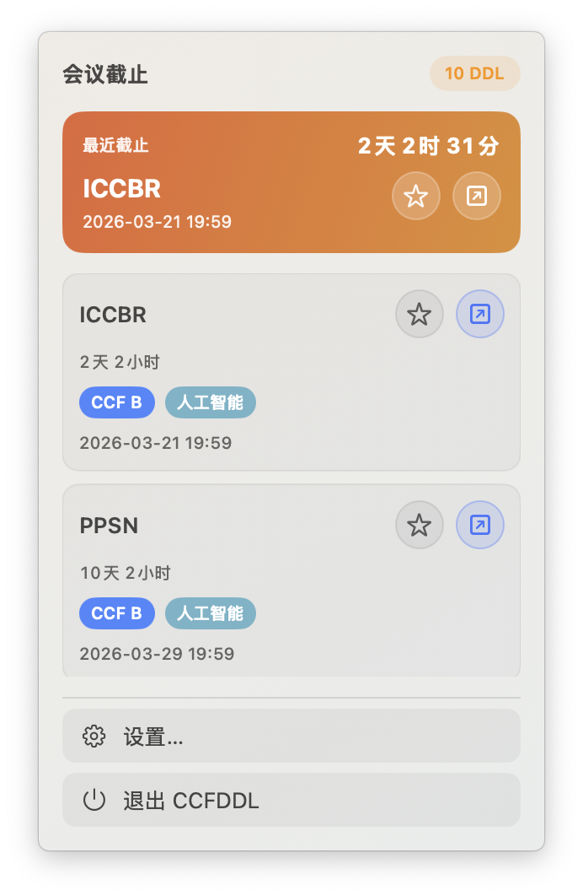
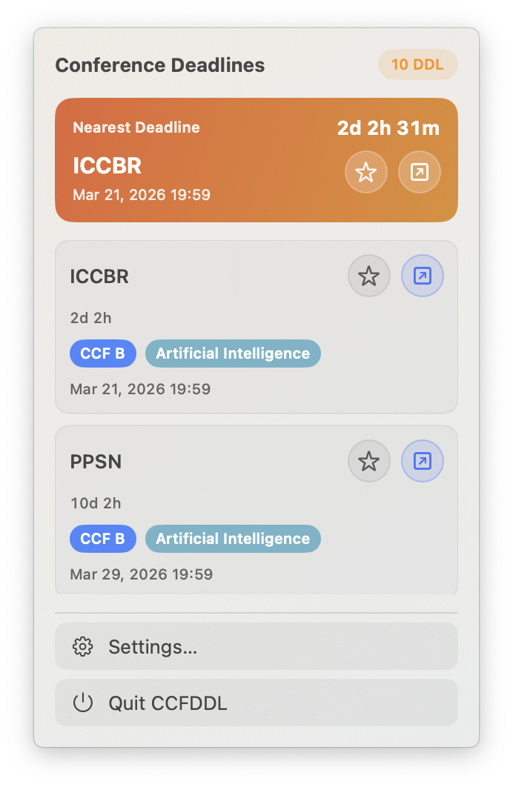

# ConfBar


Native macOS menu bar app (SwiftUI + MenuBarExtra) that shows upcoming CCFDDL conference deadlines and live countdowns.

[中文文档](./README-zh.md)

## Screenshots




## Features

- Menu bar title defaults to `ConfBar`; you can pin a conference and show minute-level countdown (for example `AAAI: 2d 10h 20m`)
- Searchable conference picker in menu bar settings (alias + fuzzy matching)
- Dropdown panel with upcoming deadlines (top 30 by default)
- Dedicated settings window for filtering, sorting, reminders, and calendar export
- Quit entry available in both menu panel and settings window
- Manual refresh + automatic refresh every 30 minutes
- Click conference item to open the official website
- Deadline reminders via local notifications (`24h/6h/1h`, configurable)
- One-click `.ics` calendar export
- Search enhancement with aliases (for example `NeurIPS/NIPS`) and fuzzy matching
- Smart sorting by time-to-deadline, conference date, or CCF rank (default: time-to-deadline)
- Persistent filters and preferences (keyword, CCF rank, area, favorites-only, sort mode, selected menu-bar conference)
- Favorites are pinned to the top
- Data source: `https://ccfddl.cn/`

## Requirements

- macOS 13+
- Xcode 16+ (or Swift 6.0+ toolchain)

## Run

After launch, a menu bar item appears (default `CCF`).  
This is a menu-bar-only app and does not show a Dock icon.
Open the standalone settings window from the menu panel via "Settings...".
When reminders are enabled for the first time, macOS will ask for notification permission.

## Project Structure

```text
confbar/
├── Assets/                          # App assets (icon and screenshots)
│   └── Screenshots/                # README screenshots
├── Sources/ConfBar/                  # Core logic and app entry
│   └── Views/                      # Menu bar and settings UI
├── LICENSE                         # MIT license
├── NOTICE                          # Data source attribution
├── Package.swift                   # Swift Package manifest
├── README.md                       # English README entry
└── README-zh.md                    # Chinese README
```

## License

This project is released under the MIT License. See [LICENSE](./LICENSE).

## Data Source and Attribution

- This app fetches public conference information from `https://ccfddl.cn/` for deadline display and reminders.
- This is an independent client implementation and is not an official release from `ccfddl`.
- If you reuse this project code, keep the [LICENSE](./LICENSE).
- If you include or reuse code/data from `ccfddl/ccf-deadlines`, preserve its MIT license and copyright notices.

## Acknowledgements

- Upstream ecosystem project: [`ccfddl/ccf-deadlines`](https://github.com/ccfddl/ccf-deadlines) (MIT)
- Additional notes in [NOTICE](./NOTICE)
